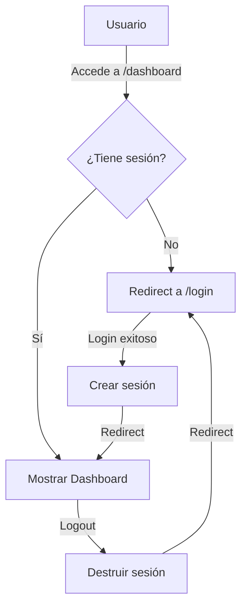

# 🔐 Better Auth - Documentación

## Configuración Completada

Se ha implementado **Better Auth** como sistema de autenticación para el proyecto Wedding Guest Management App.

---

## 📦 Stack de Autenticación

- **Better Auth** v1.x - Sistema de autenticación moderno
- **Prisma** - ORM y gestión de base de datos
- **bcryptjs** - Hash de contraseñas
- **Next.js Middleware** - Protección de rutas

---

## 🗄️ Modelos de Base de Datos

### User
```prisma
model User {
  id            String    @id @default(cuid())
  name          String?
  email         String    @unique
  emailVerified Boolean   @default(false)
  image         String?
  role          String    @default("guest") // "admin" o "guest"
  createdAt     DateTime  @default(now())
  updatedAt     DateTime  @updatedAt
  sessions      Session[]
  accounts      Account[]
}
```

### Session
```prisma
model Session {
  id        String   @id @default(cuid())
  expiresAt DateTime
  token     String   @unique
  ipAddress String?
  userAgent String?
  userId    String
  user      User     @relation(fields: [userId], references: [id], onDelete: Cascade)
}
```

### Account
```prisma
model Account {
  id                String  @id @default(cuid())
  accountId         String
  providerId        String
  userId            String
  password          String?  // Para email/password auth
  // ... otros campos OAuth
}
```

### Verification
```prisma
model Verification {
  id         String   @id @default(cuid())
  identifier String
  value      String
  expiresAt  DateTime
}
```

---

## 🚀 Configuración

### 1. Variables de Entorno (.env)

```env
# Better Auth
BETTER_AUTH_SECRET=your-super-secret-key-change-this-in-production
BETTER_AUTH_URL=http://localhost:3000

# Database
DATABASE_URL="postgresql://..."
```

### 2. Archivo de Configuración (lib/auth.ts)

```typescript
import { betterAuth } from "better-auth";
import { prismaAdapter } from "better-auth/adapters/prisma";

export const auth = betterAuth({
  database: prismaAdapter(prisma, {
    provider: "postgresql",
  }),
  emailAndPassword: {
    enabled: true,
    requireEmailVerification: false,
  },
  session: {
    expiresIn: 60 * 60 * 24 * 7, // 7 días
    updateAge: 60 * 60 * 24,
  },
  user: {
    additionalFields: {
      role: {
        type: "string",
        defaultValue: "guest",
      },
    },
  },
});
```

### 3. Cliente Frontend (lib/auth-client.ts)

```typescript
import { createAuthClient } from "better-auth/react";

export const authClient = createAuthClient({
  baseURL: process.env.NEXT_PUBLIC_APP_URL,
});

export const {
  signIn,
  signOut,
  signUp,
  useSession,
} = authClient;
```

---

## 📍 Rutas API

### `/api/auth/[...all]`
Maneja todas las operaciones de autenticación automáticamente:
- `POST /api/auth/sign-in/email` - Iniciar sesión
- `POST /api/auth/sign-up/email` - Registrarse
- `POST /api/auth/sign-out` - Cerrar sesión
- `GET /api/auth/session` - Obtener sesión actual
- Y más...

---

## 🎨 Componentes UI

### 1. Página de Login (`/login`)
- Tabs para Login/Register
- Validación de formularios
- Manejo de errores con toasts
- Diseño con gradientes pink-purple

### 2. UserMenu Component
- Avatar con iniciales
- Dropdown con opciones:
  - Perfil
  - Configuración
  - Cerrar Sesión
- Muestra nombre, email y rol

### 3. Header Component
- Logo con navegación
- Links activos resaltados
- UserMenu integrado
- Responsive design

---

## 🛡️ Protección de Rutas

### Middleware (middleware.ts)

```typescript
export function middleware(request: NextRequest) {
  const { pathname } = request.nextUrl;
  
  // Rutas públicas
  const publicPaths = ["/login", "/api/auth"];
  const isPublicPath = publicPaths.some(path => pathname.startsWith(path));
  
  if (isPublicPath) {
    return NextResponse.next();
  }
  
  // Verificar sesión
  const session = request.cookies.get("better-auth.session_token");
  
  if (!session) {
    return NextResponse.redirect(new URL("/login", request.url));
  }
  
  return NextResponse.next();
}
```

**Rutas protegidas:**
- `/dashboard`
- `/families`
- `/guests`
- `/tables`
- Todas excepto `/login` y `/api/auth/*`

---

## 👤 Roles de Usuario

### Admin
- Acceso completo a todas las funcionalidades
- Gestión de familias, invitados y mesas
- Envío de notificaciones
- Generación de reportes

### Guest
- Acceso limitado al portal RSVP
- Solo puede confirmar asistencia de su familia
- Ver información de su mesa asignada

---

## 🔧 Uso en Componentes

### Obtener Sesión Actual

```typescript
"use client";
import { useSession } from "@/lib/auth-client";

export function MyComponent() {
  const { data: session, isPending } = useSession();
  
  if (isPending) return <div>Cargando...</div>;
  if (!session) return <div>No autenticado</div>;
  
  return <div>Hola, {session.user.name}!</div>;
}
```

### Iniciar Sesión

```typescript
import { signIn } from "@/lib/auth-client";

const handleLogin = async () => {
  const result = await signIn.email({
    email: "user@example.com",
    password: "password123",
  });
  
  if (result.error) {
    console.error(result.error.message);
  } else {
    router.push("/dashboard");
  }
};
```

### Cerrar Sesión

```typescript
import { signOut } from "@/lib/auth-client";

const handleLogout = async () => {
  await signOut();
  router.push("/login");
};
```

### Registrar Usuario

```typescript
import { signUp } from "@/lib/auth-client";

const handleRegister = async () => {
  const result = await signUp.email({
    email: "newuser@example.com",
    password: "password123",
    name: "Nuevo Usuario",
  });
  
  if (result.error) {
    console.error(result.error.message);
  }
};
```

---

## 🛠️ Scripts de Utilidad

### Crear Usuario Admin

```bash
# Ejecutar script
npm run create-admin

# O con ts-node
npx ts-node scripts/create-admin.ts
```

**Credenciales por defecto:**
- Email: `admin@wedding.com`
- Contraseña: `admin123`
- Rol: `admin`

⚠️ **IMPORTANTE:** Cambiar estas credenciales en producción

---

## 🔒 Seguridad

### Mejores Prácticas Implementadas

1. **Hash de Contraseñas**: bcryptjs con salt rounds
2. **Sesiones Seguras**: Tokens firmados y verificados
3. **HTTPS Only**: Cookies secure en producción
4. **CSRF Protection**: Incluido en Better Auth
5. **Expiración de Sesiones**: 7 días configurables

### Pendientes para Producción

- [ ] Configurar `requireEmailVerification: true`
- [ ] Implementar recuperación de contraseña
- [ ] Agregar 2FA (Two-Factor Authentication)
- [ ] Rate limiting en login
- [ ] Logs de intentos de acceso
- [ ] Cambiar `BETTER_AUTH_SECRET` a valor fuerte

---

## 📊 Flujo de Autenticación



---

## 🧪 Testing

### Verificar Instalación

1. **Sincronizar DB:**
   ```bash
   npx prisma db push
   npx prisma generate
   ```

2. **Crear usuario admin:**
   ```bash
   npx ts-node scripts/create-admin.ts
   ```

3. **Iniciar servidor:**
   ```bash
   npm run dev
   ```

4. **Probar login:**
   - Ir a http://localhost:3000
   - Debería redirigir a /login
   - Login con admin@wedding.com / admin123
   - Debería redirigir a /dashboard

---

## 🔮 Próximos Pasos

### Funcionalidades Adicionales

- [ ] **OAuth Providers** - Google, Facebook
- [ ] **Email Verification** - Verificación de email
- [ ] **Password Reset** - Recuperación de contraseña
- [ ] **2FA** - Autenticación de dos factores
- [ ] **Session Management** - Ver sesiones activas
- [ ] **Audit Logs** - Registro de actividad
- [ ] **Role-Based Access** - Permisos granulares

### Integración con Sistema Existente

- [ ] Conectar FamilyHead con User (opcional)
- [ ] Portal RSVP con autenticación por código
- [ ] Admin panel para gestión de usuarios
- [ ] Reportes de actividad de usuarios

---

## 📚 Referencias

- [Better Auth Docs](https://www.better-auth.com/)
- [Prisma Adapter](https://www.better-auth.com/docs/integrations/prisma)
- [Next.js Integration](https://www.better-auth.com/docs/integrations/nextjs)

---

## ✅ Checklist de Implementación

- [x] Instalación de Better Auth
- [x] Modelos de Prisma agregados
- [x] Configuración de auth server
- [x] Cliente de auth frontend
- [x] Página de login/register
- [x] Middleware de protección
- [x] UserMenu component
- [x] Header component
- [x] Script de admin user
- [ ] Sincronizar base de datos
- [ ] Crear usuario admin inicial
- [ ] Probar flujo completo

---

**Implementación completada el 5 de noviembre de 2025** 🎉
